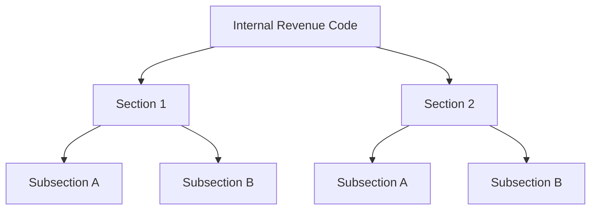
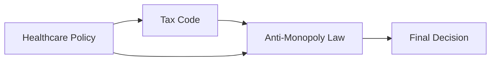
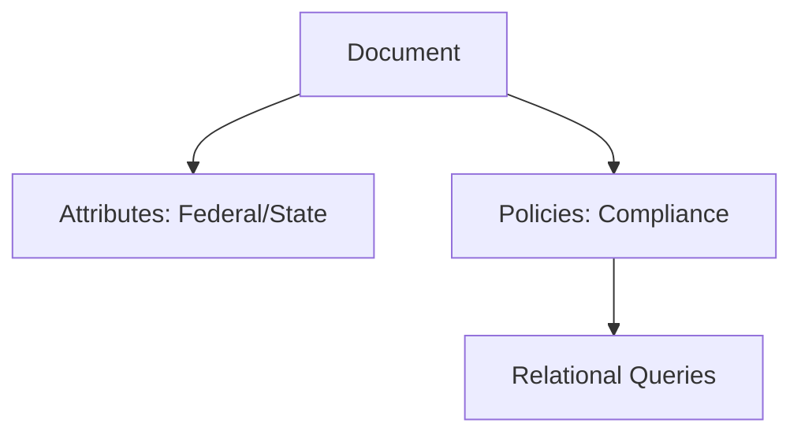
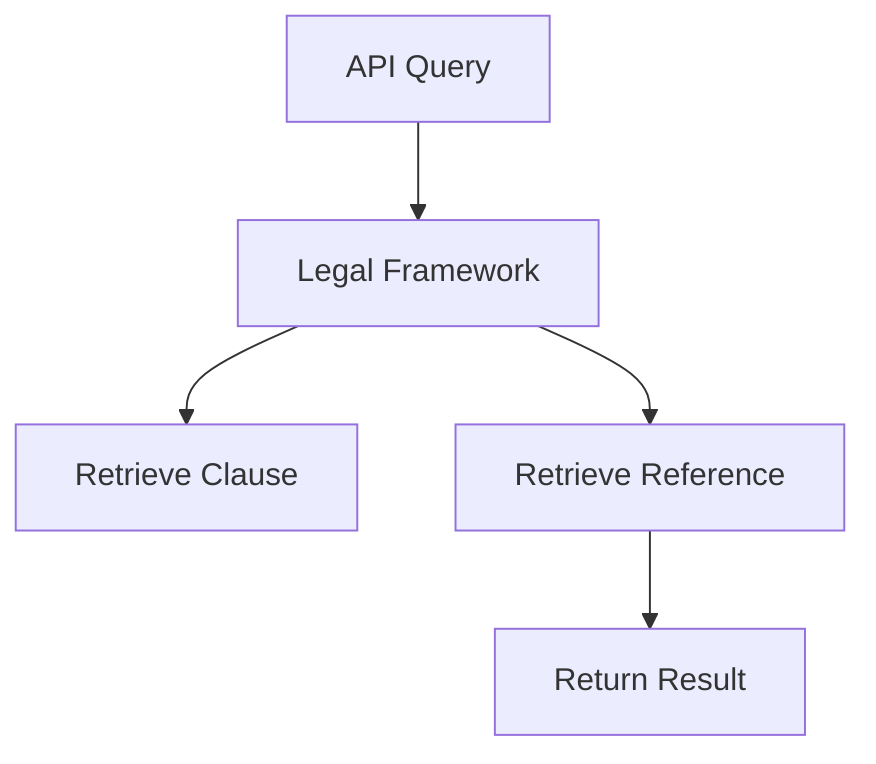

# **Bridging Neural and Relational Networks: A New Framework for Scalable AI Systems**

### **Introduction**
As AI evolves, neural networks have excelled in isolated tasks like pattern recognition, but they often fail to infer complex relationships across disciplines like law, healthcare, and finance without heavy computational requirements. To address this challenge, I propose **Relational Neural Networks (RNNs)**—an innovative framework that combines the strength of neural networks with **context-driven relational networks** to dynamically map and manage relationships across multiple domains.

This approach is rooted in my journey of building enterprise-grade AI and cloud systems, where I recognized the need for AI models to be more **contextually aware** and **relationship-driven**. By applying **modular, attribute-based structures**, these RNNs offer more efficient, real-time insights that mimic how humans naturally think about complex, interconnected problems.

---

### **The Gaps in Current AI Models**
Traditional AI models struggle with reasoning across **different domains** without repeatedly reprocessing relationships. For example, understanding how **healthcare policies** interact with **tax regulations** requires recalculating relationships each time new data is queried. This inefficiency leads to increased computational costs and slower decision-making processes.

In my work, I realized that much like in **real-world systems**—whether it's managing complex IT infrastructure or even everyday problem-solving—relationships between entities are **predefined** by rules or **policies** that govern how they interact. By embedding these relationships directly into the data, **Relational Neural Networks (RNNs)** remove the need for constant recalculation.

---

### **Introducing Modular Relational Neural Networks (RNNs)**
RNNs are designed to break down datasets into **modular components**, where each module operates independently but also interacts through **policies** and **attributes** that define how relationships between nodes are formed and maintained. The core components of RNNs are:

- **Nodes**: Representing entities such as legal sections, healthcare regulations, or data points.
- **Attributes**: Contextual properties that define a node’s scope (e.g., whether it’s **federal or state law**, **clinical or administrative regulation**).
- **Policies**: Governing rules that dictate how nodes can interact. These ensure relationships are **meaningful** and follow **logical constraints**.
- **Strings**: Efficient pathways for querying relationships between nodes in real-time, much like a **neural pathway**.

These elements come together to create a **modular framework**, where different domains (e.g., healthcare, tax, law) can interact, following the same **real-world rules** of interconnectedness. Much like when I visualize real-world problems—such as how a seemingly small decision impacts many subsequent events—RNNs capture these **interactions and dependencies** in a structured way.

---

### **Configuring Relationships, Attributes, and Policies**
At the heart of RNNs are the **policies** that govern relationships between nodes. These policies provide **context** to how each node interacts with another, much like real-world systems follow certain rules or protocols for interactions. For example:

- A legal framework may include a policy that specifies **state laws** must comply with overarching **federal regulations**. This would prevent contradictions and ensure that cross-referencing between the two always follows the correct hierarchy.
- In healthcare, a policy might dictate that **clinical guidelines** must always adhere to **administrative laws** regarding patient privacy. This policy ensures that when querying data on **clinical practices**, the AI is aware of how these practices relate to **legal privacy frameworks**.

#### **Example 1: Internal Revenue Code Mapping**

Here, the **Internal Revenue Code** is broken down into sections and subsections, with each node representing a **tax provision**. By defining **attributes** (e.g., federal/state law) and applying **policies** (e.g., anti-contradiction rules between sections), RNNs allow for efficient querying and interaction between these elements.

This mirrors how I approach complex IT systems in my work. Just as I would configure access controls (e.g., RBAC or ABAC) in an enterprise system to define who can access what, **policies in RNNs** define the **interactions** between data points based on contextual rules.

---

### **Real-World Parallel: Systems Thinking in Action**
In my daily work, I often see parallels between how humans structure their decisions and how AI should manage relationships. For example, when I deal with a technical problem, I don’t simply react to each event in isolation—I think about how that event connects to others. A small action, like moving a document or unplugging a laptop cable, has cascading effects, just as relationships between datasets in an AI system do.

In RNNs, I’ve mirrored this natural **systems-level thinking** by creating frameworks that reflect how **policies and attributes** guide interactions. When an AI model queries a **legal precedent**, it doesn’t just return information randomly—it uses **policies** to guide how one legal document relates to others.

### **Cross-Domain Queries: Creating Efficient Interactions**
RNNs excel in scenarios that require **cross-domain reasoning**. For example, if you’re analyzing how **healthcare law** interacts with **financial regulations**, the AI will pull the relevant sections based on **pre-configured policies** and **attributes**.

#### **Example 2: Cross-Domain Queries**

In this example, **healthcare policies**, **tax codes**, and **anti-monopoly laws** interact based on **predefined policies**. For instance, if a merger between healthcare companies is in question, the system will **automatically reference** the tax codes and anti-monopoly regulations that govern the financial impact of the merger.

Much like I think about how **small decisions** (e.g., technical configuration changes) affect broader systems (e.g., an entire network), RNNs are designed to **preconfigure rules** that dictate how these domains interact, reducing the need for repeated recalculation.

---

### **Attribute-Based Design and Modular Policies**

In this framework, **attributes** provide important context to each node. Attributes tell the AI **what type of data** it’s dealing with (e.g., **state law** vs. **federal law**, **tax regulation** vs. **anti-monopoly law**) and **policies** ensure that these attributes are respected when interacting with other nodes.

For example, attributes in a **healthcare module** might denote whether the law pertains to **clinical or administrative practices**. Policies ensure that when a query is made about **clinical guidelines**, the AI also checks if **administrative compliance** is required.

#### **Example 3: Attributes and Policies Structure**

This structure shows how **attributes** and **policies** work together to build a relational query system. Policies ensure that certain queries (e.g., cross-referencing **federal and state laws**) are governed by the same contextual rules that exist in the real world.

---

### **String-Based Querying and Real-Time Access**
**String-based querying** allows RNNs to function more like human reasoning—where instead of reprocessing all data from scratch, it follows **strings** (or connections) that lead directly to relevant answers. These strings provide an efficient way to traverse **legal documents**, **policies**, and other datasets.

#### **Example 4: API Query Example**

This querying model allows the AI to reference only the **relevant clauses** in real-time without having to process every document from scratch. **Policies** define how the AI selects and ranks the clauses based on their **jurisdiction** (e.g., federal or state law).

---

### **Conclusion**
**Relational Neural Networks (RNNs)** represent a new way of building AI models that can **embed relationships**, **attributes**, and **policies** directly into data, reducing computational load and improving efficiency. By mimicking real-world decision-making systems and how humans think about **interconnected events**, RNNs provide a powerful, scalable solution to managing cross-domain data relationships.

My personal journey, from solving complex enterprise problems to developing relational AI systems, has led me to this realization: AI must be designed to think about relationships **before** data is queried, just as we do in real life. By creating these **modular frameworks** with **predefined relationships**, we can enhance AI’s ability to **contextualize data**, improve decision-making, and scale

 across multiple domains.

---

### **Call to Action**
This is an open invitation to academics, developers, and industry professionals to collaborate in the further development of **Relational Neural Networks** and explore their potential to drive **cross-disciplinary insights**. Let’s push the boundaries of what AI can do when we empower it to think **relationally**.
