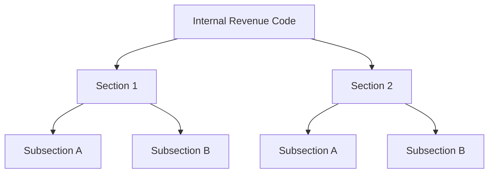
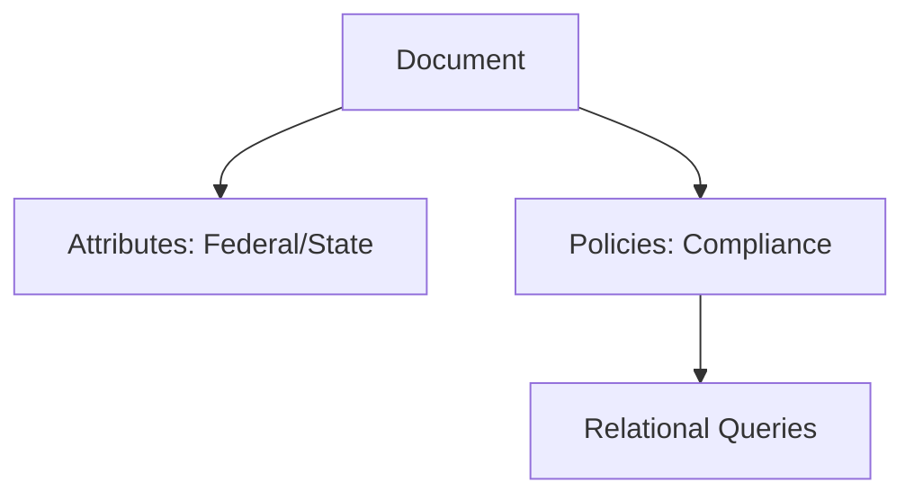
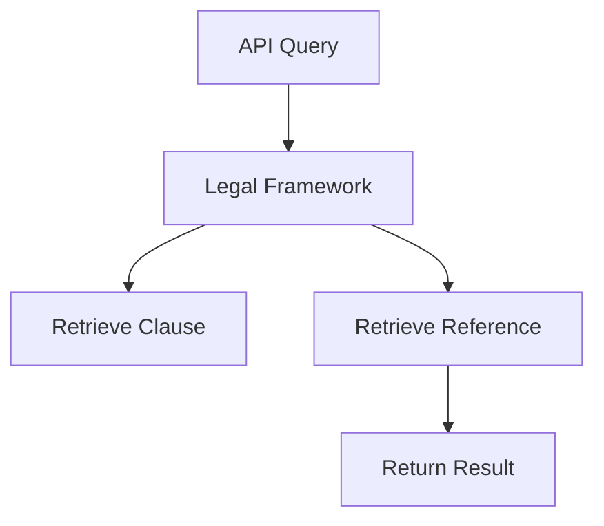
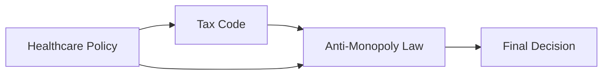
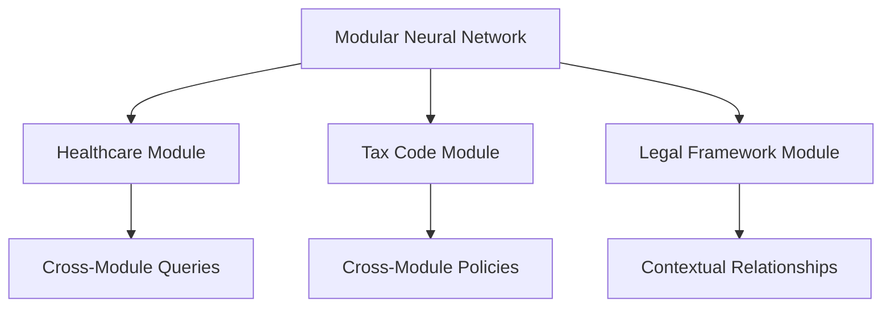

# **Bridging Neural and Relational Networks: A New Framework for Scalable AI Systems**

### **Introduction**
In the evolving landscape of AI, models have achieved remarkable advancements, but there remains a significant gap in the ability of neural networks to efficiently handle cross-domain relationships across complex fields such as law, healthcare, and finance. This thesis introduces **Relational Neural Networks (RNNs)**—a next-generation framework that merges the computational power of neural networks with relational networks, creating **modular, attribute-based systems** that dynamically map complex relationships.

This approach is rooted in both my professional experience and my personal journey. Over the years, I’ve learned to identify and **build connections in real life**, whether it's understanding how legal codes interact with financial systems or seeing the implications of small actions in everyday life—such as a misplaced cable interrupting a work routine. These insights on **systems thinking** have led me to understand the importance of not just collecting vast amounts of data but **structuring relationships** between data points with precision, using **attributes and policies** to govern the connections.

By focusing on precision, **Relational Neural Networks** reduce computational overhead and enhance the AI model's ability to solve real-world, high-level problems.

---

### **Identifying the Gaps in Current AI Models**
AI models have excelled at specific tasks like image recognition and language generation. However, these models still struggle when it comes to **interrelating data across domains**. Traditional neural networks need large amounts of data and computational power to infer relationships, often resulting in **inefficient processing** of context-rich or cross-domain data. 

This problem mirrors challenges I’ve encountered in everyday life. For instance, consider the frustration caused by the lack of awareness in small actions like leaving a door open, which has **unintended ripple effects** such as increased energy use and misplacing items. These real-world experiences have taught me that relationships and actions are interconnected—just like data in AI systems. If we can define those **relationships** up front, instead of relying on post hoc inference, we can **improve efficiency** and **precision** dramatically.

Relational Neural Networks solve this by **pre-defining relationships and attributes within the data structure**, allowing AI to focus on making informed decisions rather than recalculating connections from scratch.

---

### **The Concept: Modular Relational Neural Networks (RNNs)**
RNNs break down data into **modular components** that can be individually queried or related to each other dynamically. Each module contains:

- **Nodes**: Representing data points (documents, sections, entities).
- **Attributes**: Defining the characteristics and context of each node (e.g., federal/state, clinical/administrative).
- **Policies**: Governing the relationships between nodes, ensuring that connections follow logical, contextual rules.
- **Strings**: Predefined paths for querying related nodes, allowing for efficient real-time data retrieval.

This approach draws from my understanding of how systems behave in the real world. Just as different systems in life—like healthcare, tax codes, and legal systems—interact based on certain policies and rules, **RNNs mirror these real-world interdependencies**.

In a legal framework, for instance, **nodes** may represent sections and clauses of a legal document, while **attributes** define whether these clauses are federal or state-specific. **Policies** could enforce how these clauses interact, ensuring that **cross-document relationships**—such as references to precedents—adhere to legal frameworks.

---

### **Building Relationships Across Domains**

In the context of RNNs, the relationships between data nodes are built on **real-world rules** just like how we form mental models when connecting events, objects, and outcomes in life. For example, when we think about the legal impact of healthcare regulations, we don't reinvent the relationships between laws every time—they’re governed by pre-existing rules and policies.

In RNNs, these **relationships are explicitly defined** between nodes, and policies guide how connections between nodes are formed across datasets. For instance, in a tax law system, a policy might stipulate that **federal provisions** override **state rules** in the context of financial reporting.

#### **Example 1: Internal Revenue Code Mapping**

This example represents a hierarchical breakdown of the **Internal Revenue Code**. Each section, subsection, and clause is treated as a **node** with its own set of **attributes** (such as state/federal), and the policies that govern their relationships are pre-configured to enforce **compliance rules**. Just like in real-world thinking, these **predefined relationships** allow AI to understand how these clauses interact without needing to reprocess all the data.

---

### **Attributes and Policies: Providing Context to Relationships**
One of the core aspects of Relational Neural Networks is that **attributes and policies** are configured to provide **context**. In many ways, this reflects my own real-world ability to identify relationships. In daily life, I’m always thinking about how seemingly unrelated things—like the knock-on effects of minor actions—are interconnected. This is how I translate **systems thinking** into AI.

**Attributes** represent the characteristics of nodes. For instance, in legal documents, an attribute could define whether a clause is **applicable at the federal level** or only relevant to state matters. In healthcare, attributes might specify whether a regulation relates to **clinical practice** or **administrative process**.

**Policies** are rules that **govern how these nodes interact**. For example, a policy could dictate that a section of the law cannot contradict another section, or that certain regulations take precedence over others. By configuring these policies ahead of time, RNNs allow for **precision** in how the relationships are formed and navigated.

#### **Example 2: Attributes and Policies Structure**

In this structure:
- **Attributes** give the AI a **contextual understanding** of the data it’s processing. For instance, the AI would know that federal laws take precedence over state laws in a compliance query.
- **Policies** enforce the logical rules behind these relationships, ensuring that the data remains consistent across domains.

---

### **String-Based Querying: Efficient Data Retrieval with Precision**
In RNNs, **string-based querying** allows for efficient real-time access to related data. Instead of reprocessing the entire dataset, the AI system follows pre-defined **query strings** that link related sections. These strings can reference **specific clauses** or **legal precedents**, speeding up the retrieval process.

This mirrors how I’ve approached problem-solving in my own life—focusing not on **the abundance of data** but on **building relationships** that allow for better decision-making.

#### **Example 3: API Query Example**

In this example:
- An API query is made into the **Legal Framework**.
- The system uses **predefined relationships** to pull relevant clauses and references based on the query string, adhering to policies governing those relationships.

---

### **Interconnected Thinking and Multi-Domain Queries**

In real life, we often need to pull insights from different disciplines—like understanding how healthcare regulations interact with tax law. **RNNs make this possible** by allowing the AI to handle **cross-domain queries** based on the relationships, attributes, and policies we’ve defined in advance.

#### **Example 4: Cross-Domain Queries**

Here, we see the interaction between healthcare policies and tax codes in the context of **anti-monopoly law**. This cross-domain query allows the AI to consider **multiple data sets** simultaneously, governed by policies that maintain the logical relationships between them.

In the real world, this mirrors how I’ve been able to **cross-apply insights** from different fields—seeing how tax law interacts with finance or how seemingly minor actions in daily life have **wide-reaching implications**.

---

### **Dense Relationships: Structuring Neural Networks for Precision**

By embedding these relationships, attributes, and policies within the **data structure**, we create **dense relational networks** that enable the AI to process data more **efficiently**. In contrast to traditional neural networks that require vast computational resources to infer relationships, **RNNs** pre-define the **contextual links** between data points.

#### **Example 5: Modular Neural Network Architecture with RNN Integration**

In this model:
-

 Each module (Healthcare, Tax Code, Legal Framework) operates independently but interacts through **cross-module queries**.
- **Policies** govern the relationships between these modules, allowing the AI to navigate complex, cross-domain issues with precision.
  
This mirrors how, in my own thinking, I’ve been able to **build connections between different domains**, whether it's understanding how financial policies interact with healthcare systems or how small decisions impact larger workflows.

---

### **Conclusion: Precision, Context, and AI for the Future**
Relational Neural Networks (RNNs) provide a revolutionary way to handle complex, cross-domain data relationships by embedding **attributes** and **policies** into the data structure. This approach prioritizes **precision** and **efficiency** over raw computational power, allowing AI models to handle more **complex reasoning** across multiple fields.

Through this framework, I’ve been able to apply the **interconnected thinking** I’ve developed in real life—building relationships between seemingly unrelated concepts and translating that understanding into an AI architecture that reflects the **true complexity** of the systems we live in.

By focusing on relationships rather than just data, RNNs offer a powerful tool for building AI systems that mirror the **cognitive thinking** we use to navigate our daily lives.

--- 

### **Call to Action**

This thesis is an invitation for collaboration. By sharing these ideas through the **OpenEye** project and other platforms, I hope to work with academics, professionals, and developers who are interested in advancing **AI model efficiency** through **relational and modular frameworks**. Reach out to me to explore how **Relational Neural Networks** can drive innovation across multiple sectors.

**Contact:**

- **LinkedIn**: [Callum Maystone](https://www.linkedin.com/in/callum-maystone)
- **Medium**: [My Publications](https://medium.com/@callum_26623)
- **GitHub**: [OpenEye Project](https://github.com/yourgithub/openeye)

