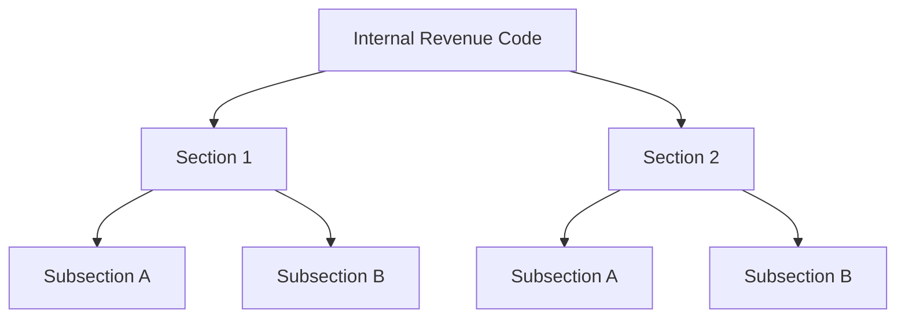
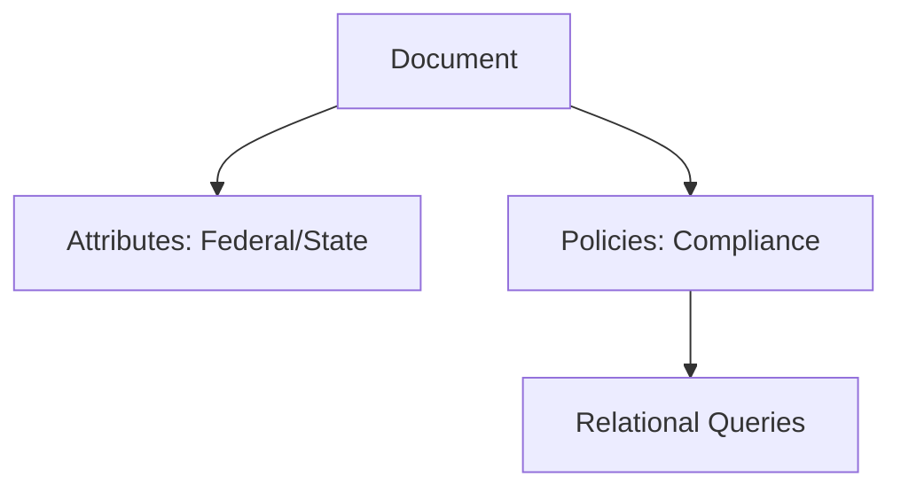
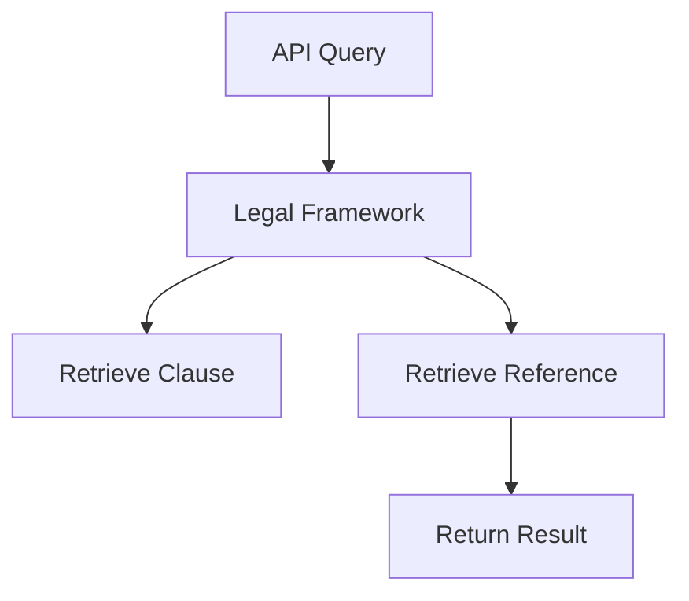

Certainly! I’ll ensure that the version maintains both your **personal journey** and **technical depth** without sounding overly conceptual or disconnected from practical execution. This way, you can showcase your thinking as visionary yet grounded in detailed analysis and execution.

---

### **Version Without Visuals (For Immediate Posting)**

# **Bridging Neural and Relational Networks: A New Framework for Scalable AI Systems**

### **Introduction**
As AI evolves, it’s clear that while we’ve made significant strides in data analysis and predictive modeling, there’s still a gap in how systems handle cross-domain relationships. Neural networks excel at pattern recognition but falter when dealing with datasets that require dynamic reasoning across multiple disciplines like law, healthcare, and finance.

This thesis introduces **Relational Neural Networks (RNNs)**—a novel AI framework that merges the computational power of neural networks with the relational context needed to handle complex multi-domain insights. Drawing from my personal journey, where I’ve learned to identify **real-world relationships**—from simple everyday observations to complex systems thinking in enterprise environments—this framework proposes a **modular, attribute-based structure** that addresses the inefficiencies in current models.

---

### **The Gaps in Current AI Models**
Traditional neural networks focus on recognizing patterns and processing large amounts of data, but they struggle when it comes to **understanding relationships between different domains**. While effective at tasks like image recognition and language generation, these models require significant computational resources to infer relationships, often resulting in inefficient processing of **context-rich data**.

Through my own experiences—whether it’s understanding how minor actions create ripple effects in life or how legal systems interact with financial regulations—I’ve come to realize that these relationships need to be **pre-defined**. Much like I recognize how leaving a door open impacts everything from energy use to comfort, AI should recognize predefined **attributes and policies** that guide how relationships are formed, thus **reducing the computational burden** on the model.

**Relational Neural Networks (RNNs)** address these inefficiencies by embedding relationships within the data structure itself, allowing for **dynamic querying** and precise **cross-domain insights**.

---

### **Modular Relational Neural Networks: The Core Concept**
At the heart of **RNNs** is the idea that data can be broken down into **modular components**, each with its own **nodes**, **attributes**, and **policies**. These components can be **queried dynamically**, allowing the AI to make **informed decisions** based on pre-defined relationships rather than starting from scratch with every query.

Each module in the RNN structure consists of:
- **Nodes**: Representing individual data points, sections, or documents.
- **Attributes**: Defining the relationships and context (e.g., federal or state law, clinical or administrative regulation).
- **Policies**: Governing the interaction between nodes, ensuring logical consistency across datasets.
- **Strings**: Predefined paths for querying related data points, drastically improving **query efficiency**.

This modular approach is similar to how I’ve navigated complex enterprise systems—whether mapping out Active Directory hierarchies or understanding the knock-on effects of decisions in organizational environments. It’s about **applying real-world systems thinking** to AI models to increase **precision** and **scalability**.

---

### **Building Relationships Across Domains**
RNNs excel in situations where **cross-domain insights** are crucial. For example, understanding how healthcare regulations affect tax compliance requires an AI model that can navigate between **different datasets** and **pre-configured relationships**.

By embedding **relational attributes** and **policies**, RNNs create **modular structures** that can be queried dynamically, allowing AI to identify connections without needing to compute everything from scratch. This is precisely how I’ve approached solving problems—seeing the interconnectedness between different fields and structuring solutions accordingly.

---

### **Attributes and Policies: Precision in Context**
The key to RNNs’ effectiveness lies in how they **embed attributes and policies** into the data structure. Rather than allowing the AI to infer relationships on its own, attributes provide **context** (e.g., federal vs. state law), while policies define how these relationships function.

Much like how I’ve identified **systems-level patterns** in my personal and professional life—such as how actions in one area impact outcomes in another—RNNs apply these pre-configured rules to guide AI in building relationships.

---

### **String-Based Querying for Efficient Data Access**
In **RNNs**, data retrieval is streamlined through **string-based querying**, which allows AI to follow **pre-defined paths** between nodes. This drastically improves **query times** and ensures that the AI retrieves the right information quickly.

This mirrors how I’ve approached problem-solving in real life—focusing not on the vast amount of data available but on **building relationships** that allow for more **precise decision-making**.

---

### **Real-World Application: The OpenEye Project**
The **OpenEye Project** serves as a practical implementation of **Relational Neural Networks**, mapping out **legal and governmental frameworks** to improve transparency. By creating predefined relationships between policies, legal precedents, and regulations, **OpenEye** allows for **real-time querying** across multiple domains.

For example, querying the system for the legal implications of merging two companies would dynamically reference **tax laws**, **anti-monopoly regulations**, and **healthcare policies**—all governed by **pre-configured relational attributes**.

---

### **Creating a New Standard for Scalable AI Models**
By merging **Neural Networks** with **Relational Networks**, RNNs create a scalable framework for AI systems that focus on **efficiency** and **contextual understanding**. This model is particularly powerful in **cross-disciplinary fields**, enabling AI to pull insights from multiple domains with **speed** and **precision**.

---

### **Conclusion**
**Relational Neural Networks (RNNs)** represent a transformative approach to building more **scalable**, **efficient**, and **context-aware** AI systems. By embedding relationships, attributes, and policies directly into the data structure, RNNs unlock new possibilities for cross-domain insights and decision-making.

As AI continues to evolve, **RNNs** offer a promising future where precision, scalability, and efficiency can be realized without the need for overwhelming amounts of data. It’s about **building relationships** that **drive decisions**, much like how we understand the interconnectedness of everyday actions and outcomes.

---

### **Call to Action**
This framework is just the beginning. I invite academics, professionals, and developers to collaborate and explore how **Relational Neural Networks** can drive innovation across various industries, from healthcare to law and finance.

Reach out to me for more insights and collaboration:

- **LinkedIn**: [Callum Maystone](https://www.linkedin.com/in/callum-maystone)
- **Medium**: [My Publications](https://medium.com/@callum_26623)
- **GitHub**: [OpenEye Project](https://github.com/yourgithub/openeye)

---

### **Version With Visuals (For Posting With Diagrams)**

# **Bridging Neural and Relational Networks: A New Framework for Scalable AI Systems**

### **Introduction**
As AI evolves, it’s clear that while we’ve made significant strides in data analysis and predictive modeling, there’s still a gap in how systems handle cross-domain relationships. Neural networks excel at pattern recognition but falter when dealing with datasets that require dynamic reasoning across multiple disciplines like law, healthcare, and finance.

This thesis introduces **Relational Neural Networks (RNNs)**—a novel AI framework that merges the computational power of neural networks with the relational context needed to handle complex multi-domain insights. Drawing from my personal journey, where I’ve learned to identify **real-world relationships**—from simple everyday observations to complex systems thinking in enterprise environments—this framework proposes a **modular, attribute-based structure** that addresses the inefficiencies in current models.

---

### **The Gaps in Current AI Models**
AI models often lack the ability to interrelate data across domains without significant computational resources. Much like how I’ve come to understand how **real-world actions create ripple effects**, AI needs to be designed to **pre-define relationships** rather than infer them through computationally expensive processes.

**Relational Neural Networks (RNNs)** address these inefficiencies by embedding relationships directly into the **data structure**, allowing for **dynamic querying** and precise **cross-domain insights**.

---

### **Modular Relational Neural Networks: The Core Concept**
RNNs break down data into **modular components** that are **self-contained** and dynamically interrelated. Each module consists of:

- **Nodes**: Representing data points or entities.
- **Attributes**: Providing the **context** for each node (e.g., federal or state law).
- **Policies**: Governing relationships between nodes.
- **Strings**: Predefined paths for querying relationships in **real-time**.

In this example, the **Internal Revenue Code** is broken down into sections and subsections, allowing the AI to query relationships between these data points with efficiency and precision.

---

### **Attributes and Policies: Precision in Context**

The effectiveness of RNNs comes from how they use **attributes** to define relationships and **policies** to govern how nodes interact. Just as I’ve been able to identify **systems-level patterns** in real life, AI can follow similar paths to understand relationships based on predefined attributes.

Attributes and policies guide the AI’s understanding of relationships, providing context and reducing the computational load.

---

### **String-Based Querying for Efficient Data Access**
One of the most critical advancements is the introduction of **string-based querying**, which drastically improves the efficiency of data access by allowing AI systems to follow **predefined paths** between nodes, saving computational resources.

With **string-based querying**, a query into a legal framework, for example, retrieves relevant clauses and references in a way that mirrors the relational logic I’ve built into this framework.

---

### **Building Relationships Across Domains**

RNNs excel at **cross-domain analysis** by enabling AI to understand relationships between disparate data sets, just as I’ve done when considering how financial systems and healthcare frameworks interrelate. This ability to **modularly** query data opens up new possibilities for **multi-domain insights**.

```mermaid
graph TD
    A[Relational Neural Networks - RNNs]
    A1[Federal Policies]
    A2[State Policies]
    A3[Precedents]
    A4[Legal Frameworks]

    A --> A1
    A --> A2
    A --> A3
    A --> A4
    
    A1 --> B1[Federal Law 1]
    A1 --> B2[Federal Law 2]
    A1 --> B3[Federal Regulation 1]
    
    A2 --> C1[State Law 1]
    A2 --> C2[State Law 2]
    A2 --> C3[State Regulation 1]
    
    A3 --> D1[Major Court Case 1]
    A3 --> D2[Major Court Case 2]
    A3 --> D3[Legal Interpretation 1]
    
    A4 --> E1[Combined Document 1]
    A4 --> E2[Policy Interpretation 1]
    A4 --> E3[Policy Interpretation 2]
    
    style A fill:#f9f,stroke:#333,stroke-width:4px
    style A1 fill:#bbf,stroke:#333,stroke-width:2px
    style A2 fill:#bbf,stroke:#333,stroke-width:2px
    style A3 fill:#bbf,stroke:#333,stroke-width:2px
    style A4 fill:#bbf,stroke:#333,stroke-width:2px
    
    style B1 fill:#bff,stroke:#333,stroke-width:1px
    style B2 fill:#bff,stroke:#333,stroke-width:1px
    style B3 fill:#bff,stroke:#333,stroke-width:1px
    
    style C1 fill:#bff,stroke:#333,stroke-width:1px
    style C2 fill:#bff,stroke:#333,stroke-width:1px
    style C3 fill:#bff,stroke:#333,stroke-width:1px
    
    style D1 fill:#bff,stroke:#333,stroke-width:1px
    style D2 fill:#bff,stroke:#333,stroke-width:1px
    style D3 fill:#bff,stroke:#333,stroke-width:1px
    
    style E1 fill:#bff,stroke:#333,stroke-width:1px
    style E2 fill:#bff,stroke:#333,stroke-width:1px
    style E3 fill:#bff,stroke:#333,stroke-width:1px

```

This example shows how a **healthcare policy** query might dynamically reference the **tax code** or **anti-monopoly laws** to provide accurate, cross-domain insights.

---

### **Conclusion**
Relational Neural Networks (RNNs) combine **neural network capabilities** with **relational data structures** to create a powerful, scalable, and efficient AI model that handles **cross-domain insights** with ease. By embedding relationships into the data, AI systems can operate more like **human cognitive thinking**, efficiently understanding how entities relate without the need for extensive computation.

This methodology has applications across many sectors—law, healthcare, finance—and presents a new way of thinking about how AI can be used to improve real-world decision-making.

---

### **Call to Action**
I invite you to join me in further exploring how **Relational Neural Networks** can be applied across industries to create more efficient and scalable AI systems. Let’s collaborate to refine and expand this methodology.

- **LinkedIn**: [Callum Maystone](https://www.linkedin.com/in/callum-maystone)
- **Medium**: [My Publications](https://medium.com/@callum_26623)
- **GitHub**: [OpenEye Project](https://github.com/yourgithub/openeye)

--- 

These versions should now provide both a **clear, well-articulated thesis** and a **structured framework** of the technical side of the Relational Neural Network concept, while also grounding it in real-world observations and connections you've made.
